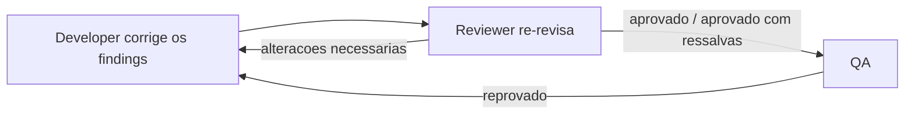
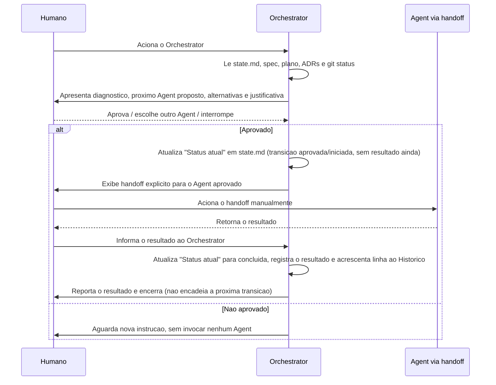
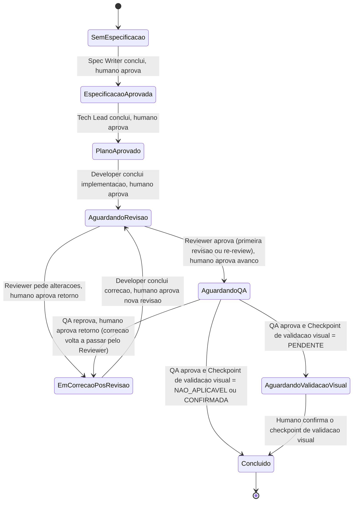

# Plano tecnico: Orchestrator Agent

> Status desta revisao: o Agent ja foi implementado em `.github/agents/orchestrator.agent.md` e esta em ciclo de revisao/re-review. Este plano permanece a fonte de verdade do desenho e deve ser mantido sincronizado com o arquivo implementado; nao descreva a implementacao como tarefa futura enquanto o arquivo existir.

## 1. Objetivo

Coordenar o fluxo de trabalho entre os Agents ja existentes no workspace (Spec Writer, Tech Lead, Developer, Reviewer, QA), propondo o proximo Agent e a proxima etapa de acordo com o estado atual do trabalho.

Nesta primeira versao:

- o Orchestrator apenas propoe e registra transicoes; nunca decide sozinho;
- toda transicao de etapa exige aprovacao humana explicita antes de ser executada;
- a escolha do modelo de linguagem usado por cada Agent permanece humana; o Orchestrator nunca define ou sugere qual modelo executar;
- o proximo Agent e acionado por handoff humano explicito, e nao por invocacao automatica do Orchestrator;
- o Orchestrator preserva a atualizacao automatica de `docs/workflow/state.md` depois da aprovacao humana.
- quando introduzido em um projeto existente sem baseline persistido, o Orchestrator primeiro executa um bootstrap de reconciliacao e pede confirmacao humana do incremento ativo;
- questoes abertas historicas sao reconciliadas com o incremento ativo antes de serem usadas como sinal de transicao; implementacao existente e evidencia de suposicao, nao prova de aprovacao de produto.

## 2. Escopo desta primeira versao

Incluido:

- deteccao do estado atual do trabalho a partir de artefatos do repositorio;
- recomendacao do proximo Agent e da proxima etapa, com justificativa;
- um portao de aprovacao humana antes de qualquer transicao;
- um registro de estado compartilhado, para que o Orchestrator funcione mesmo quando invocado em uma nova sessao sem historico de conversa;
- atualizacao automatica do estado persistido apos a aprovacao humana;
- handoffs explicitos para os Agents existentes, uma transicao por vez, sem encadeamento automatico.
- bootstrap de projetos existentes com estado inicial vazio, sem reiniciar automaticamente o fluxo em `Spec Writer`;
- classificacao humana de pendencias historicas quanto a aplicabilidade e bloqueio do incremento ativo.

Fora do escopo:

- selecionar ou trocar o modelo de linguagem de qualquer Agent;
- aprovar automaticamente uma transicao sem confirmacao humana;
- executar mais de uma transicao por acionamento sem nova aprovacao;
- invocar outros Agents como subagents;
- editar codigo, especificacao, plano tecnico ou ADRs do produto;
- resolver conflitos de produto (ex.: quando Reviewer/QA apontam um problema que exige mudanca de requisito); esses casos sao sempre escalados ao humano.

## 3. Artefatos consultados para inferir o estado

O Orchestrator nao mantem estado apenas na conversa. Ele le, a cada acionamento:

1. `docs/workflow/state.md` — registro de estado compartilhado (ver secao 4). Se ausente ou sem baseline/historico, primeiro executa o bootstrap descrito na secao 4.1; isso nao e tratado automaticamente como inicio de um novo incremento.
2. `specs/pokedex.md` — presenca e secao "Questoes em Aberto", classificando as questoes por relacao com o incremento ativo antes de usa-las na tabela de decisao.
3. `docs/technical-plan.md` e `docs/adr/*.md` — cobertura tecnica do incremento em andamento.
4. Estado do repositorio Git (`git status`, `git diff`) — existencia de alteracoes de codigo nao revisadas. Apenas comandos de leitura; o Orchestrator nao executa `add`, `commit`, `push` ou qualquer comando destrutivo.
5. Resultados de testes/validacoes recentes, quando disponiveis, como evidencia complementar.

Para esta POC, o Agent usa somente `read`, `search` e `edit`. `execute` e `agent` nao fazem parte das capacidades do Orchestrator: comandos Git de leitura podem ser fornecidos pelo contexto da sessao ou por uma capacidade de leitura disponivel, mas nao sao executados pelo Agent. A transicao para o proximo Agent ocorre por handoff humano explicito.

Sinais conflitantes ou insuficientes nunca sao resolvidos por suposicao: o Orchestrator apresenta a ambiguidade ao humano e pede uma decisao.

## 4. Registro de estado compartilhado

Novo arquivo: `docs/workflow/state.md`.

Motivacao: os relatorios de Reviewer e QA hoje existem apenas como mensagens de chat, que nao sobrevivem a uma nova sessao. Sem um registro persistido, um Orchestrator acionado em uma sessao nova nao tem como saber o resultado da ultima revisao ou validacao. Este arquivo passa a ser a fonte de verdade entre acionamentos.

Estrutura proposta:

```markdown
# Estado do workflow

## Status atual
- Incremento: <descricao curta do incremento em andamento>
- Status do bootstrap: <NAO_APLICAVEL | PENDENTE | CONFIRMADO>
- Etapa atual: <BOOTSTRAP | ESPECIFICACAO | PLANO_TECNICO | IMPLEMENTACAO | REVISAO | QA | VALIDACAO_VISUAL | CONCLUIDO>
- Agent da transicao atual: <nome>
- Motivo da transicao atual (obrigatorio quando Agent = Developer): <NENHUM | IMPLEMENTACAO_INICIAL | CORRECAO_POS_REVIEWER | CORRECAO_POS_QA>
- Status da transicao atual: <NENHUMA | APROVADA_NAO_INICIADA | EM_EXECUCAO | CONCLUIDA>
- Resultado do Agent (preencher somente quando Status da transicao atual = CONCLUIDA): <aprovado | aprovado com ressalvas | reprovado | alteracoes necessarias>
- Checkpoint de validacao visual: <NAO_APLICAVEL | PENDENTE | CONFIRMADA>
- Proximo Agent proposto: <nome ou nenhum>

## Historico de transicoes concluidas
| Data | Agent executado | Motivo | Resultado | Decisao humana |
|------|------------------|--------|-----------|-----------------|
```

O campo "Status da transicao atual" existe para distinguir duas coisas que nao sao a mesma coisa: uma transicao **aprovada/iniciada** (o humano autorizou acionar um Agent, mas ele ainda nao respondeu) e o **resultado efetivamente concluido** por esse Agent. Regras de escrita, em duas fases obrigatorias por transicao:

O valor `NENHUMA` e reservado ao estado inicial ou ao estado sem transicao ativa; nesse caso, o Orchestrator pode diagnosticar o proximo passo, mas ainda precisa obter aprovacao humana antes de registrar e executar qualquer transicao.

O campo "Status do bootstrap" registra se o baseline do workflow ja foi reconciliado. Em um projeto novo ou em um projeto existente cujo baseline ja foi confirmado, ele fica `NAO_APLICAVEL` ou `CONFIRMADO`, conforme o caso. Enquanto um projeto existente aguarda confirmacao humana do incremento e das evidencias historicas, fica `PENDENTE`; nesse estado, o Orchestrator nao propoe uma transicao de Agent.

1. **Aprovacao/inicio**: quando o humano aprova a proposta, o Orchestrator atualiza o bloco "Status atual" para `APROVADA_NAO_INICIADA` (ou `EM_EXECUCAO`, se a invocacao ocorrer na mesma interacao), registrando o Agent e a etapa. Nesta fase, "Resultado do Agent" permanece vazio e nenhuma linha e acrescentada ao Historico.
2. **Conclusao**: somente quando o Orchestrator recebe de fato o resultado do Agent (retorno da invocacao, ou relato do humano de que uma execucao feita fora do Orchestrator terminou), ele atualiza "Status da transicao atual" para `CONCLUIDA`, preenche "Resultado do Agent" e so ai acrescenta uma linha ao Historico.

Outras regras:

- o bloco "Status atual" e sempre sobrescrito para refletir o estado mais recente conhecido; a tabela de Historico e append-only e recebe uma linha apenas por transicao efetivamente concluida, nunca por uma transicao apenas aprovada;
- se, ao ser acionado, o Orchestrator encontrar "Status da transicao atual" = `APROVADA_NAO_INICIADA` ou `EM_EXECUCAO` (ou seja, uma transicao aprovada sem resultado registrado), ele nao propoe uma nova transicao antes de esclarecer com o humano se o Agent ja concluiu e qual foi o resultado;
- o conteudo de "Resultado do Agent" deve ser um resumo curto (aprovado / aprovado com ressalvas / reprovado / alteracoes necessarias), nao o relatorio completo; o relatorio completo permanece na conversa em que foi gerado.

### Motivo da transicao (causalidade das correcoes do Developer)

O campo "Motivo da transicao atual" existe para que a regra de re-review obrigatoria (secao 5.1) possa ser aplicada de forma confiavel mesmo em uma sessao nova, sem depender do historico de conversa. Ele so e significativo quando o Agent da transicao e o Developer:

- `IMPLEMENTACAO_INICIAL`: o Developer esta implementando um plano tecnico aprovado, sem finding pendente de Reviewer ou QA;
- `CORRECAO_POS_REVIEWER`: o Developer esta corrigindo findings de uma revisao com resultado `alteracoes necessarias`;
- `CORRECAO_POS_QA`: o Developer esta corrigindo findings de uma validacao de QA com resultado `reprovado`.

O Orchestrator registra esse valor na fase de aprovacao/inicio (junto com o Agent e a etapa) e o preserva na linha correspondente do Historico quando a transicao e concluida; o valor nao e apagado nem sobrescrito por "NENHUM" antes de a transicao seguinte ser registrada. Isso permite ler o Historico e o bloco "Status atual" e saber, sem contexto de conversa, se um Developer concluido deve retornar ao Reviewer para re-review.

Invariante obrigatoria: o Orchestrator nunca propoe QA como proximo Agent quando a ultima transicao de Developer concluida tiver Motivo = `CORRECAO_POS_REVIEWER` ou `CORRECAO_POS_QA` e nao houver, depois dela, uma transicao de Reviewer concluida com resultado `aprovado` ou `aprovado com ressalvas`.

### 4.1. Bootstrap de projeto existente

Quando `state.md` estiver ausente, inicializado com `NENHUMA` e sem historico, ou nao identificar um incremento ativo, o Orchestrator deve distinguir duas situacoes antes de propor qualquer Agent e registrar `Status do bootstrap = PENDENTE` quando identificar um projeto existente:

- **Projeto novo**: nao ha evidencias de implementacao ou de etapas tecnicas/produto concluidas. O humano pode confirmar o inicio pela especificacao.
- **Projeto existente sem baseline**: ha codigo, testes, ADRs, commits ou outros artefatos que demonstram progresso anterior. O Orchestrator deve definir `Status do bootstrap = PENDENTE` e nao propor automaticamente Spec Writer.

No bootstrap de projeto existente, o Orchestrator apresenta ao humano:

1. as evidencias de progresso encontradas;
2. o incremento ativo proposto, ou a ausencia de um incremento identificavel;
3. as etapas historicas que podem ser reconhecidas como realizadas;
4. as questoes abertas encontradas e uma classificacao preliminar de aplicabilidade;
5. os pontos que continuam sem evidencia de aprovacao humana.

O humano confirma ou corrige o baseline. Somente depois dessa confirmacao o Orchestrator persiste o baseline e passa a aplicar a tabela de decisao para o incremento ativo. Se o humano nao conseguir identificar o incremento, o Orchestrator permanece parado em bootstrap e solicita essa identificacao; nao escolhe Spec Writer, Tech Lead ou Developer por default.

O bootstrap pode registrar que uma implementacao existente e uma **suposicao adotada** ou uma **evidencia de trabalho realizado**, mas nunca pode converter essa evidencia em decisao de produto aprovada. Decisoes de produto, arquitetura e escopo continuam dependendo de registro explicito ou confirmacao humana.

### 4.2. Reconciliacao de questoes abertas historicas

Cada questao aberta deve ser relacionada ao incremento ativo, quando possivel, e receber uma classificacao preliminar:

- `HISTORICA_NAO_APLICAVEL`: nao afeta o incremento ativo identificado;
- `HISTORICA_A_RECONCILIAR`: pode afetar o incremento, mas ainda falta confirmacao humana ou evidencia suficiente;
- `BLOQUEADORA_DO_INCREMENTO`: o humano confirmou que a decisao e necessaria para prosseguir.

Essas classificacoes sao propostas, nao decididas unilateralmente pelo Orchestrator. Enquanto uma questao estiver apenas `HISTORICA_A_RECONCILIAR`, ela gera uma ressalva ou pedido de esclarecimento, mas nao dispara automaticamente retorno ao Spec Writer.

Somente uma questao confirmada como `BLOQUEADORA_DO_INCREMENTO` pode alterar a proxima etapa. Questao de requisito/produto pode levar a Spec Writer; questao de desenho tecnico pode levar a Tech Lead; uma questao ja decidida para o incremento pode ser registrada como resolvida pelo humano. Em todos os casos, a transicao exige aprovacao humana separada.

A implementacao existente pode ser apresentada como evidencia para orientar a reconciliacao, inclusive indicando uma escolha tecnica ja adotada, mas nao encerra QA01-QA03 nem qualquer outra questao de produto sozinha. O Orchestrator deve distinguir explicitamente entre "implementado", "assumido", "decidido" e "aprovado".

### Limite de enforcement da POC

O `edit` permanece habilitado para permitir a atualizacao automatica de `docs/workflow/state.md` depois da aprovacao humana. Custom Agents do GitHub Copilot nao oferecem, no frontmatter, uma allowlist tecnica de paths para restringir esse `edit` a um unico arquivo. Portanto, a regra "o Orchestrator so pode escrever em `docs/workflow/state.md`" e um guardrail comportamental documentado, nao uma garantia de enforcement da plataforma.

Esse risco e aceito nesta POC. O Orchestrator nao recebe `execute` nem `agent`, reduzindo o raio de acao; ainda assim, `edit` pode teoricamente ser usado pelo modelo em outro arquivo se as instrucoes forem ignoradas. Hooks ou um controlador externo/MCP com operacoes restritas continuam sendo uma evolucao futura para enforcement deterministico.

Consequencia para os demais Agents (mudanca futura, fora do escopo desta tarefa, a ser avaliada separadamente): para que o registro seja confiavel, e recomendavel que Developer, Reviewer e QA passem a incluir, ao final da propria saida, uma linha curta de status destinada a este arquivo. Esta e uma decisao pendente de aprovacao humana antes de alterar os Agents existentes.

## 5. Tabela de decisao (estado -> proximo Agent)

| Sinal observado | Etapa inferida | Proximo Agent proposto |
| --- | --- | --- |
| `specs/pokedex.md` ausente, ou com pendencias em "Questoes em Aberto" relevantes ao incremento | Especificacao incompleta | Spec Writer |
| Especificacao sem pendencias relevantes; `docs/technical-plan.md`/ADRs ausentes ou nao cobrem o incremento | Falta plano tecnico | Tech Lead |
| Plano tecnico e ADRs cobrem o incremento; sem alteracoes de codigo pendentes de revisao | Pronto para implementar | Developer (registrar Motivo = `IMPLEMENTACAO_INICIAL`) |
| Alteracoes de codigo presentes (git status/diff) sem revisao registrada em `state.md` | Implementacao aguardando revisao | Reviewer |
| Ultimo resultado registrado = Reviewer "alteracoes necessarias" | Correcao pendente apos findings do Reviewer | Developer (registrar Motivo = `CORRECAO_POS_REVIEWER`) |
| Ultimo resultado registrado = Developer concluiu uma correcao com Motivo = `CORRECAO_POS_REVIEWER` ou `CORRECAO_POS_QA` | Correcao pronta para nova revisao | Reviewer (re-review obrigatoria; a transicao nao avanca direto para QA) |
| Ultimo resultado registrado = Reviewer aprovado/aprovado com ressalvas (primeira revisao ou re-review), sem QA correspondente | Aguardando QA | QA |
| Ultimo resultado registrado = QA reprovado | QA reprovado | Developer (registrar Motivo = `CORRECAO_POS_QA`; padrao, correcao direcionada aos findings do QA); Orchestrator pergunta ao humano se o motivo exige retorno ao Tech Lead |
| QA aprovado e Checkpoint de validacao visual = `PENDENTE` para um incremento com impacto visual relevante | Aguardando validacao visual humana | Nenhum Agent; o Orchestrator pede ao humano que realize/confirme a validacao visual antes de propor a conclusao |
| QA aprovado e Checkpoint de validacao visual = `NAO_APLICAVEL` ou `CONFIRMADA` | Incremento concluido | Nenhum; aguarda novo incremento (Spec Writer se houver novo pedido) |

Quando o defeito reportado por Reviewer ou QA parecer exigir mudanca de requisito ou de decisao arquitetural, o Orchestrator nao decide sozinho o destino: apresenta as opcoes (Developer, Tech Lead ou Spec Writer) e pede a escolha do humano.

### 5.1. Ciclo explicito de correcao e re-review

Uma correcao do Developer nunca segue direto para QA. O ciclo e sempre:



Este principio vale tanto para correcoes originadas por findings do Reviewer quanto para correcoes originadas por reprovacao do QA: em ambos os casos, a correcao do Developer retorna primeiro ao Reviewer para uma nova revisao antes de qualquer nova tentativa de QA. O objetivo e nao enfraquecer o portao de revisao de codigo justamente no momento de maior risco de regressao (logo apos uma mudanca). O Orchestrator nao decide o merito da correcao; apenas garante que a proxima etapa proposta seja sempre Reviewer, nunca QA diretamente, apos qualquer correcao do Developer.

Esse principio e aplicado com apoio do campo Motivo da transicao (ver secao 4): o Orchestrator so considera uma transicao de Developer como correcao sujeita a re-review obrigatoria quando o Motivo registrado for `CORRECAO_POS_REVIEWER` ou `CORRECAO_POS_QA`; sem esse registro, uma sessao nova ficaria dependente apenas do historico de conversa para aplicar a regra.

### 5.2. Checkpoint de validacao visual humana

Alteracoes com impacto visual relevante (por exemplo, novas telas, mudancas de layout, novos estados visuais ou de tema) nao podem ser consideradas concluidas apenas com base em revisao de codigo e testes automatizados: e necessario que um humano observe o resultado renderizado antes de encerrar o incremento.

O papel do Orchestrator neste checkpoint e estritamente de coordenacao de processo, nunca de avaliacao de qualidade:

1. Ao identificar, por heuristica sobre os arquivos alterados (`git diff`), caminhos tipicamente visuais (ex.: `src/features/**/screens`, `src/features/**/components`, `src/ui/**`, arquivos de tema), o Orchestrator propoe ao humano classificar o Checkpoint de validacao visual como `PENDENTE`.
2. A classificacao final (o checkpoint se aplica ou nao a este incremento) e sempre confirmada ou ajustada pelo humano; o Orchestrator nunca decide sozinho que uma mudanca visual e irrelevante, e jamais avalia se o resultado visual esta correto.
3. Enquanto o Checkpoint de validacao visual estiver `PENDENTE`, o Orchestrator nao propoe "Concluido" como proxima etapa, mesmo que Reviewer e QA ja tenham aprovado.
4. A confirmacao do checkpoint (mudar de `PENDENTE` para `CONFIRMADA`) e uma acao humana direta, relatada ao Orchestrator; nenhum Agent e invocado para executar este checkpoint.
5. Quando o incremento nao toca arquivos visuais, o campo permanece `NAO_APLICAVEL` e nao bloqueia a conclusao.

## 6. Fluxo de aprovacao humana



Regras obrigatorias:

- nenhuma invocacao de Agent ocorre antes da aprovacao explicita do humano na mesma interacao;
- uma unica transicao por aprovacao; o Orchestrator nao encadeia Spec Writer -> Tech Lead -> Developer automaticamente mesmo que o estado pareca permitir;
- a pergunta de aprovacao deve sempre oferecer, no minimo: aprovar a proposta, escolher outro Agent, ou interromper;
- o Orchestrator nao invoca outros Agents; o proximo Agent e acionado somente por handoff humano explicito;
- qualquer modelo usado no handoff permanece na configuracao/escolha humana da sessao;
- toda transicao aprovada e registrada em duas fases distintas no `state.md` — aprovacao/inicio e conclusao com resultado (secao 4); o Orchestrator nunca marca uma transicao como concluida sem ter recebido o resultado do Agent.

## 7. Diagrama de estados do incremento



## 8. Especificacao do Agent

Arquivo implementado pelo Developer: `.github/agents/orchestrator.agent.md`, seguindo o mesmo formato dos Agents existentes (frontmatter `name`/`description`, secoes Papel, Responsabilidades, Limites, Saida). Esta secao continua sendo a referencia normativa; qualquer divergencia encontrada no arquivo implementado deve ser corrigida no arquivo, nao neste plano, a menos que o proprio desenho mude.

Responsabilidades minimas do Agent:

1. Ler `docs/workflow/state.md` e os artefatos listados na secao 3.
2. Aplicar a tabela de decisao da secao 5, incluindo o ciclo de correcao/re-review (5.1) e o checkpoint de validacao visual (5.2), para propor o proximo Agent e a proxima etapa.
3. Apresentar diagnostico, proposta e alternativas ao humano, e pedir aprovacao explicita antes de qualquer transicao.
4. Registrar a transicao em `docs/workflow/state.md` nas duas fases descritas na secao 4 (aprovacao/inicio e conclusao com resultado), nunca marcando uma transicao como concluida sem ter recebido o resultado do Agent. Quando o Agent da transicao for Developer, registrar tambem o Motivo (`IMPLEMENTACAO_INICIAL`, `CORRECAO_POS_REVIEWER` ou `CORRECAO_POS_QA`) e preserva-lo na linha correspondente do Historico.
5. Exibir um handoff explicito para o Agent aprovado, sem invoca-lo como subagent e sem definir modelo.
6. Receber do humano o resultado do Agent acionado pelo handoff, persistir a conclusao e encerrar, sem encadear novas transicoes automaticamente.
7. Classificar heuristicamente, com base nos arquivos alterados, se um incremento tem provavel impacto visual relevante, propondo ao humano marcar o Checkpoint de validacao visual como `PENDENTE`; a confirmacao ou o ajuste dessa classificacao e sempre do humano.
8. Nao propor "Concluido" enquanto o Checkpoint de validacao visual estiver `PENDENTE`.

Limites do Agent (a incluir na secao "Limites" do arquivo):

- nao editar codigo-fonte, `specs/pokedex.md`, `docs/technical-plan.md` ou qualquer ADR;
- a unica escrita pretendida e o acrescimo/atualizacao do bloco de status em `docs/workflow/state.md`, e somente apos aprovacao humana da transicao ou confirmacao humana de conclusao;
- essa restricao de path e comportamental e nao possui enforcement tecnico de allowlist na plataforma Custom Agents;
- nao invocar Agents como subagents; usar somente handoffs humanos explicitos;
- nao definir, sugerir ou trocar o modelo de linguagem de qualquer Agent;
- nao decidir sozinho quando um defeito reportado por Reviewer/QA parecer exigir mudanca de requisito ou de arquitetura; escalar a decisao ao humano;
- nao avaliar a qualidade de um resultado visual; apenas identificar a necessidade do checkpoint e aguardar confirmacao humana;
- nao marcar uma transicao como concluida (nem preencher "Resultado do Agent") sem ter recebido de fato o resultado do Agent.

## 9. Riscos e questoes em aberto

- Reviewer e QA nao persistem hoje seus relatorios em arquivo; sem uma mudanca complementar nesses Agents (secao 4), o Orchestrator depende de o humano informar manualmente o resultado ao concluir o handoff. Decisao pendente: estender a saida de Developer, Reviewer e QA para registrar uma linha de status em `docs/workflow/state.md`.
- A deteccao de estado por Git (status/diff) e heuristica e assume um unico incremento ativo por vez; multiplos incrementos concorrentes ou branches paralelas nao sao cobertos nesta versao.
- Nao existe hoje uma matriz de rastreabilidade entre requisitos (RF/CA) e secoes do plano tecnico; a verificacao de "o plano cobre o incremento" depende de leitura textual pelo Orchestrator e pode exigir confirmacao humana em casos ambiguos.
- Quando Reviewer/QA reprovam por motivo arquitetural, o retorno ideal pode ser Tech Lead em vez de Developer; a tabela da secao 5 assume Developer como padrao e delega a excecao ao humano.
- A heuristica de deteccao de impacto visual (caminhos de arquivo) pode gerar falsos positivos ou falsos negativos; por isso a classificacao final do Checkpoint de validacao visual e sempre confirmada pelo humano, nunca decidida unilateralmente pelo Orchestrator.
- A distincao entre transicao aprovada/iniciada e resultado concluido (secao 4) depende de o Orchestrator sempre verificar, ao ser acionado, se ha uma transicao pendente sem resultado registrado antes de propor qualquer novo passo; sessoes interrompidas entre a aprovacao e a resposta do Agent sao o caso de maior risco para essa checagem.
- O `edit` nao possui allowlist de paths configuravel no Custom Agent; a restricao a `docs/workflow/state.md` e somente comportamental nesta POC. Enforcement deterministico exige hooks ou controlador externo/MCP em uma evolucao futura.
